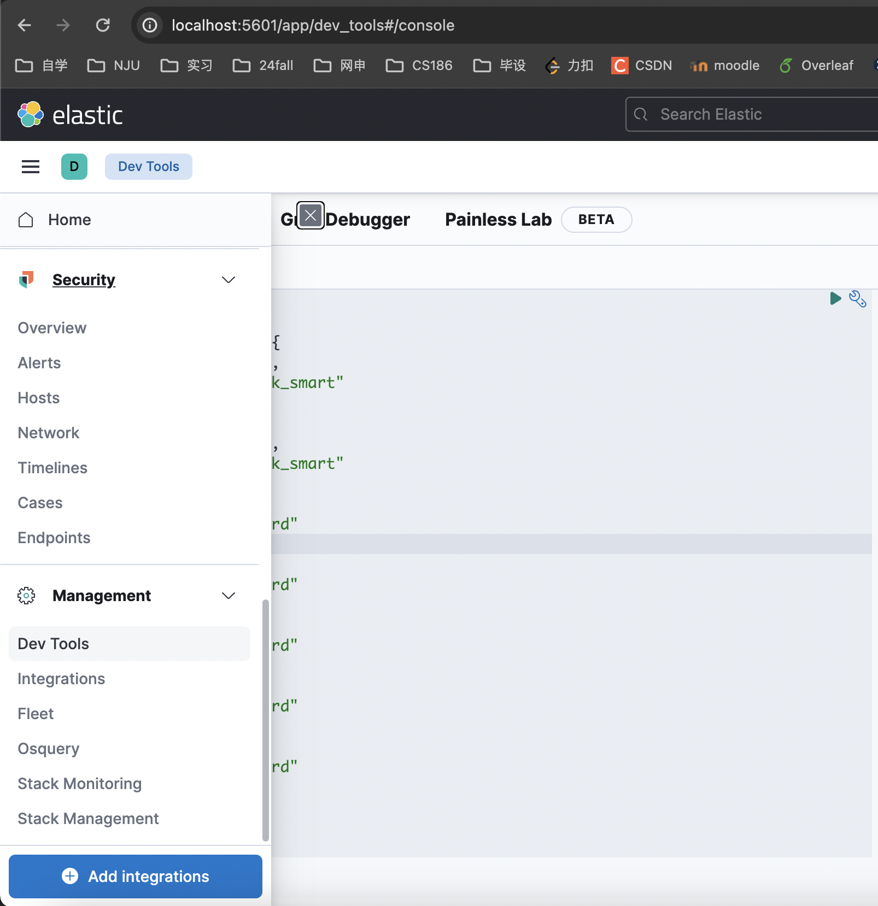
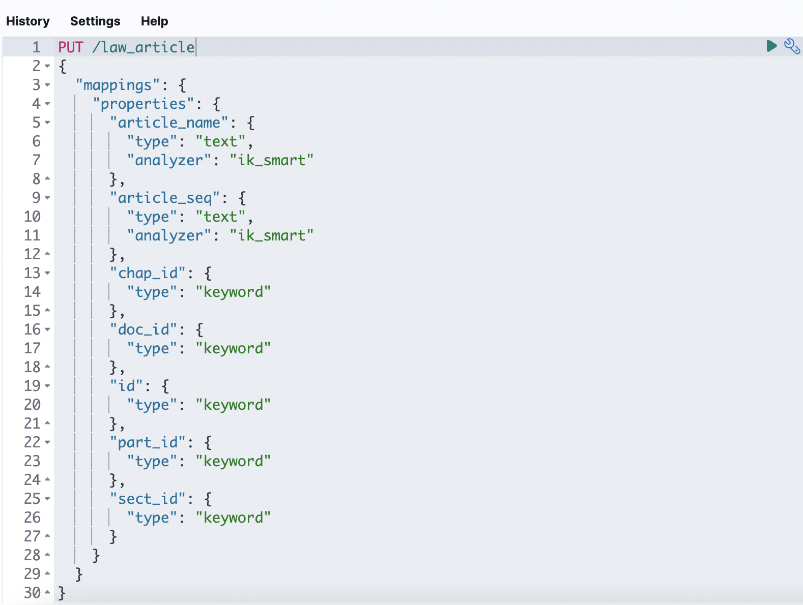

# ES环境设置

1. 参考https://blog.csdn.net/weixin_43863895/article/details/106631161安装es（均使用 docker 安装，注意需要挂载相应的目录）。我安装的版本是7.16.2。脚本在src/main/resources/script/es+kibana启动脚本.bash。
2. 在kibana控制台运行以下命令创建index。

```
PUT /law_doc
{
  "mappings": {
    "properties": {
      "articleSum": {
        "type": "long"
      },
      "divided": {
        "type": "integer"
      },
      "docURL": {
        "type": "keyword"
      },
      "docCategory": {
        "type": "keyword"
      },
      "docText": {
        "type": "text",
        "analyzer": "ik_smart"
      },
      "expiry": {
        "type": "date",
        "format": "yyyy-MM-dd"
      },
      "fullContent": {
        "type": "text",
        "analyzer": "ik_max_word",
        "fielddata": true
      },
      "id": {
        "type": "keyword"
      },
      "office": {
        "type": "text",
        "analyzer": "ik_smart"
      },
      "properties": {
        "properties": {
          "title": {
            "properties": {
              "analyzer": {
                "type": "text",
                "fields": {
                  "keyword": {
                    "type": "keyword",
                    "ignore_above": 256
                  }
                }
              },
              "fields": {
                "properties": {
                  "title": {
                    "properties": {
                      "analyzer": {
                        "type": "text",
                        "fields": {
                          "keyword": {
                            "type": "keyword",
                            "ignore_above": 256
                          }
                        }
                      },
                      "type": {
                        "type": "text",
                        "fields": {
                          "keyword": {
                            "type": "keyword",
                            "ignore_above": 256
                          }
                        }
                      }
                    }
                  }
                }
              },
              "type": {
                "type": "text",
                "fields": {
                  "keyword": {
                    "type": "keyword",
                    "ignore_above": 256
                  }
                }
              }
            }
          }
        }
      },
      "publish": {
        "type": "date",
        "format": "yyyy-MM-dd"
      },
      "status": {
        "type": "keyword"
      },
      "suffix": {
        "type": "keyword"
      },
      "title": {
        "type": "text",
        "fields": {
          "keyword": {
            "type": "keyword"
          },
          "title": {
            "type": "completion",
            "analyzer": "ik_smart",
            "preserve_separators": true,
            "preserve_position_increments": true,
            "max_input_length": 50
          }
        },
        "analyzer": "ik_smart"
      },
      "type": {
        "type": "keyword"
      }
    }
  }
}

```

```
PUT /law_article
{
  "mappings": {
    "properties": {
      "articleName": {
        "type": "text",
        "analyzer": "ik_smart"
      },
      "articleSeq": {
        "type": "text",
        "analyzer": "ik_smart"
      },
      "chapterId": {
        "type": "keyword"
      },
      "docId": {
        "type": "keyword"
      },
      "id": {
        "type": "keyword"
      },
      "partId": {
        "type": "keyword"
      },
      "sectionId": {
        "type": "keyword"
      }
    }
  }
}
```





3. 执行src/test/java/com/lkms/EsTest.java中的bulkInsertDocIntoEs()和bulkInsertArticleIntoEs()将数据库中的数据导入ES中，完成ES数据初始化。
